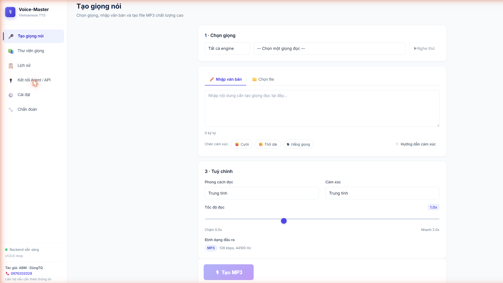
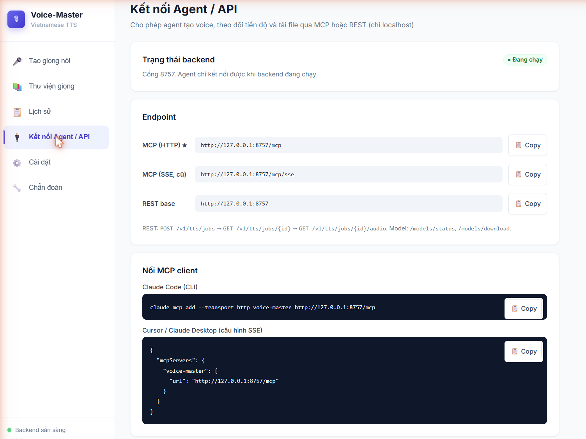
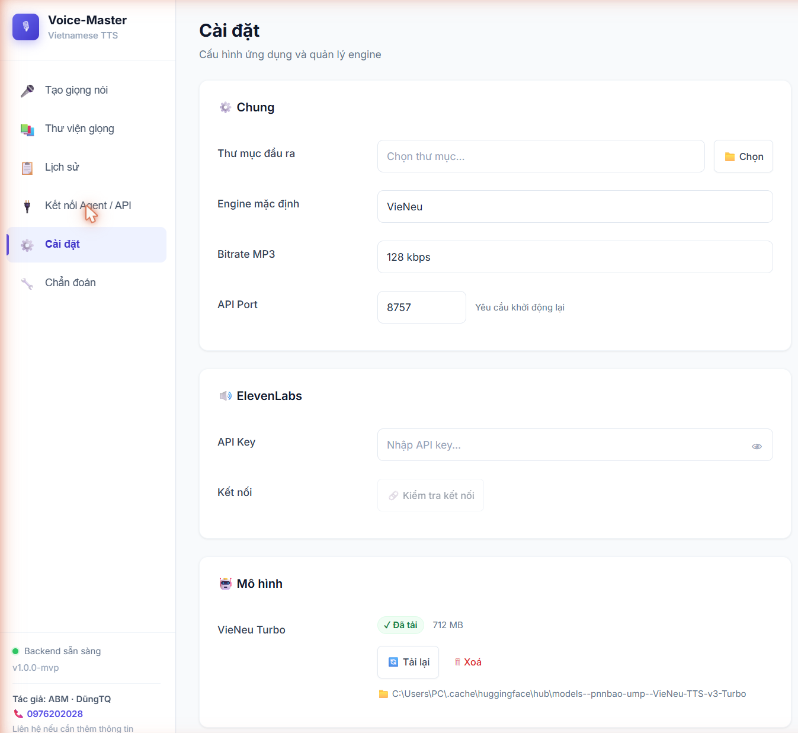
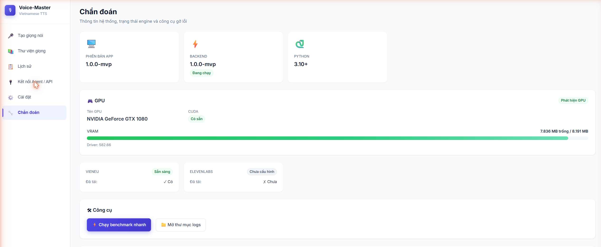

<div align="center">

# 🎙️ Voice-Master

### Biến mọi con chữ thành giọng nói tiếng Việt có cảm xúc — ngay trên máy bạn

*Đọc truyện, làm video, lồng tiếng, podcast… không cần internet, không lo lộ nội dung, không tốn phí mỗi lần tạo.*

**100% chạy nội bộ (VieNeu-TTS)** · **Điều khiển cảm xúc** · **Tự chia & ghép kịch bản dài** · **API/MCP cho Agent**

</div>

---

## 💡 Vì sao bạn sẽ thích Voice-Master?

> Bạn từng dán văn bản vào công cụ online, chờ đợi, rồi lo lắng nội dung của mình bị gửi lên máy chủ lạ?
> Voice-Master làm điều ngược lại: **mọi thứ diễn ra trên chính máy của bạn.**

- 🔒 **Riêng tư tuyệt đối** — văn bản không rời khỏi máy (engine VieNeu chạy offline).
- 💸 **Miễn phí mãi mãi** — tạo bao nhiêu file MP3 cũng được, không tính theo ký tự.
- 🎭 **Giọng có hồn** — chèn cảm xúc `[cười]`, `[thở dài]`… ngay trong câu, chọn phong cách đọc & tốc độ.
- 📖 **Kịch bản dài? Không vấn đề** — tự động chia đoạn, đọc lần lượt rồi **ghép thành 1 file** liền mạch.
- 🤖 **Agent tự động hoá** — đưa repo cho AI agent, nó tự cài đặt và tạo hàng loạt voice qua MCP.

---

## ✨ Tính năng nổi bật

| | |
|---|---|
| 🎙️ **Text → MP3** | Nhập văn bản hoặc file `.txt`/`.md`, chất lượng cao 44.1kHz |
| 🎭 **Cảm xúc & phong cách** | Thẻ inline `[cười]`/`[thở dài]`/`[hắng giọng]` + emotion + mode + tốc độ |
| 🧩 **Chia đoạn thông minh** | Script siêu dài tự cắt theo câu/đoạn rồi ghép lại mượt mà |
| ⬇️ **Tải model 1 lần** | Tự tải VieNeu từ HuggingFace lần đầu, sau đó dùng offline |
| 🔌 **MCP + REST** | Agent kết nối `http://127.0.0.1:8757/mcp` tạo voice theo vòng lặp |
| 🖥️ **Chạy ngầm** | Backend chạy nền trên PC, tự bật khi đăng nhập Windows |

---

## 🖼️ Giao diện

> Ảnh chụp thực tế của ứng dụng (đặt trong [`docs/images/`](docs/images/)).

| Tạo giọng nói | Kết nối Agent / API |
|:---:|:---:|
|  |  |

| Cài đặt & quản lý mô hình | Chẩn đoán hệ thống (GPU & engine) |
|:---:|:---:|
|  |  |

---

## 🚀 Bắt đầu nhanh

> **Yêu cầu:** Windows 10/11 · Python 3.12 · `uv` (tự cài nếu thiếu). Lần đầu cần mạng để tải model (~700MB).

### Cách A — Đưa cho Agent (khuyên dùng để chia sẻ) 🤖
Clone repo, rồi đưa file [`AGENT_SETUP.md`](AGENT_SETUP.md) cho AI agent của bạn. Agent chỉ cần chạy **một lệnh**:
```powershell
powershell -ExecutionPolicy Bypass -File scripts\setup.ps1        # CPU/ONNX (mọi máy)
powershell -ExecutionPolicy Bypass -File scripts\setup.ps1 -Gpu   # + CUDA torch (máy NVIDIA)
```
→ tự cài `uv` + `ffmpeg` + dependencies (vieneu/onnxruntime…) + **bật backend chạy ngầm** ở `http://127.0.0.1:8757`.
Mặc định chạy **CPU/ONNX** (chạy được mọi máy); thêm `-Gpu` nếu có **GPU NVIDIA** để render nhanh hơn.
Sau đó agent nối **MCP** `http://127.0.0.1:8757/mcp` và tự tạo voice. Xong! 🎉

### Cách B — Dùng giao diện (cho người dùng thường) 🖥️
```powershell
# 1) Bật backend (chạy ngầm)
powershell -ExecutionPolicy Bypass -File scripts\start_backend_detached.ps1

# 2) Mở giao diện web
pnpm install
pnpm dev:web        # → http://localhost:5173
```
Lần đầu app sẽ mời bạn **tải mô hình**, bấm một nút và đợi là xong. HDSD chi tiết: [docs/huong-dan-su-dung.md](docs/huong-dan-su-dung.md).

---

## 🎭 Thổi cảm xúc vào giọng đọc

Ba lớp kết hợp được — càng phối hợp, giọng càng "đời":

1. **Thẻ inline trong văn bản** (mạnh nhất): `[cười]`, `[thở dài]`, `[hắng giọng]` — đặt ngay trước cụm cần biểu cảm.
2. **Cảm xúc (emotion):** trung tính · ấm áp · nghiêm túc · kể chuyện · hào hứng · trầm buồn.
3. **Phong cách (mode) + tốc độ:** tin tức · đọc truyện · podcast…

```
[cười] Trời ơi, tin này tuyệt quá đi! ... [thở dài] Nhưng mình vẫn phải làm cho xong đã.
```
Chi tiết cho agent: [docs/agent-api.md](docs/agent-api.md) (mục "Thêm cảm xúc vào script").

---

## 🔌 Dành cho Agent (MCP)

Endpoint khuyến nghị: **Streamable HTTP** `http://127.0.0.1:8757/mcp`. Vòng lặp:
```
synthesize  →  wait_for_job  →  download_job_audio  →  (kịch bản kế) → lặp
```
Bộ tool: `list_voices`, `get_model_status`, `ensure_model_ready`, `synthesize`, `get_job_status`,
`wait_for_job`, `download_job_audio`, `get_history`, `cancel_job`. Hợp đồng đầy đủ: [docs/agent-api.md](docs/agent-api.md).

---

## 🛠️ Quản lý backend chạy ngầm

| Lệnh | Tác dụng |
|------|----------|
| `scripts\start_backend_detached.ps1` | Bật backend chạy ngầm (port 8757) |
| `scripts\status_backend.ps1` | Kiểm tra đang chạy / tắt |
| `scripts\stop_backend.ps1` | Tắt backend |
| `scripts\install_autostart.ps1` | Tự bật khi đăng nhập Windows (`-Remove` để gỡ) |

---

## 📚 Tài liệu
- [AGENT_SETUP.md](AGENT_SETUP.md) — agent tự cài đặt & sử dụng
- [docs/agent-api.md](docs/agent-api.md) — API/MCP + cách chèn cảm xúc
- [docs/huong-dan-su-dung.md](docs/huong-dan-su-dung.md) — hướng dẫn dùng giao diện

---

<div align="center">

## 👤 Tác giả & Liên hệ

**ABM · DũngTQ**
📞 **0976 202 028**
*Liên hệ nếu cần thêm thông tin / hỗ trợ cài đặt.*

Made with ❤️ for the Vietnamese community · License [MIT](LICENSE)

</div>
